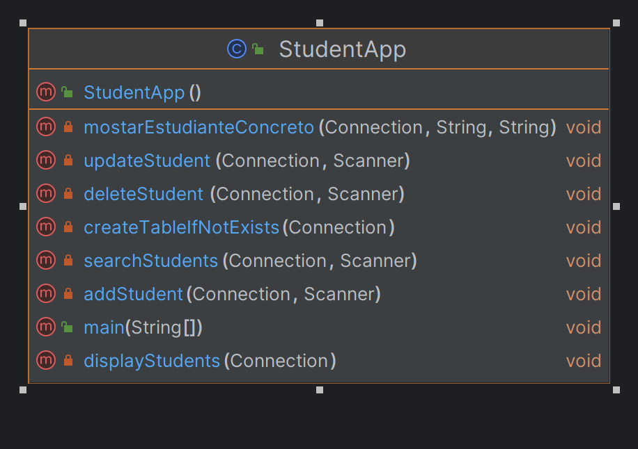

# Documentación Técnica - Aplicación de Estudiantes
## Descripción General
La aplicación StudentApp es un programa Java diseñado para gestionar información de estudiantes en una base de datos MySQL. Permite realizar operaciones como mostrar estudiantes, agregar nuevos estudiantes, actualizar información, eliminar estudiantes y buscar estudiantes según diferentes criterios. Utiliza JDBC para la conexión a la base de datos y evita la inyección de SQL mediante el uso de sentencias SQL preparadas.
## Configuración de la Base de Datos
Antes de ejecutar la aplicación, se deben configurar las credenciales y detalles de la base de datos. Actualice la URL de conexión, el nombre de usuario y la contraseña en el método main dentro del bloque try.
Connection connection = DriverManager.getConnection("jdbc:mysql://localhost/academia", "root", "");

## Estructura de la Base de Datos
La aplicación utiliza una tabla llamada students con los siguientes campos:
#### id (INT): Identificador único del estudiante (clave primaria).
#### Nombre (VARCHAR): Nombre del estudiante.
#### Apellido (VARCHAR): Apellido del estudiante.
#### Edad (INT): Edad del estudiante.
#### Curso (VARCHAR): Curso del estudiante.
La tabla se crea automáticamente si no existe cuando se ejecuta la aplicación por primera vez.

## Funcionalidades Principales
### 1. Mostrar Estudiantes
   El método displayStudents recupera todos los estudiantes de la base de datos y muestra su información en la consola.

### 2. Agregar Estudiante
   El método addStudent permite al usuario ingresar información para agregar un nuevo estudiante a la base de datos. Utiliza una sentencia SQL preparada para evitar la inyección de SQL.

### 3. Actualizar Estudiante
   El método updateStudent permite al usuario actualizar la información de un estudiante existente mediante la entrada de un ID. También utiliza una sentencia SQL preparada.

### 4. Eliminar Estudiante
   El método deleteStudent permite al usuario eliminar un estudiante de la base de datos proporcionando su ID. Emplea una sentencia SQL preparada.

### 5. Buscar Estudiantes
   El método searchStudents presenta un menú que permite al usuario elegir el tipo de búsqueda (por ID, nombre, apellido, curso o mostrar todos). Luego, se llama al método mostarEstudianteConcreto para ejecutar la búsqueda.

### 6. Métodos Adicionales
   createTableIfNotExists: Crea la tabla students si no existe en la base de datos.
   mostarEstudianteConcreto: Muestra estudiantes según un tipo de búsqueda y un término específico.

## Consideraciones de Seguridad
Se utiliza la clase Class.forName para cargar el controlador JDBC y manejar excepciones en caso de que el controlador no esté disponible.
Se utilizan sentencias SQL preparadas para evitar la inyección de SQL al interactuar con la base de datos.

## Ejecución
La aplicación se ejecuta desde el método main. Presenta un menú interactivo que permite al usuario seleccionar las operaciones deseadas hasta que elija salir (opción 6).

## Diagrama de clases

## Division de los métodos

### 1. main - Método Principal
   El método main es el punto de entrada principal de la aplicación. Realiza las siguientes funciones:

Carga del Controlador JDBC: Utiliza Class.forName para cargar el controlador JDBC de MySQL. Esto es necesario para establecer la conexión a la base de datos.

Establecimiento de Conexión: Se conecta a la base de datos utilizando las credenciales proporcionadas (URL, nombre de usuario, y contraseña). En este caso, se conecta a una base de datos llamada "academia".

Creación de la Tabla: Llama al método createTableIfNotExists para crear la tabla students si no existe.

Menú de Opciones: Presenta un bucle de menú interactivo que permite al usuario seleccionar diversas operaciones, como mostrar estudiantes, agregar, actualizar, eliminar, buscar estudiantes o salir del programa.

### 2. createTableIfNotExists - Crear Tabla si no Existe
   Este método crea la tabla students en la base de datos si no existe. Utiliza una sentencia SQL para definir la estructura de la tabla, que incluye campos como id, Nombre, Apellido, Edad, y Curso. La clave primaria es el campo id.

### 3. displayStudents - Mostrar Estudiantes
   Recupera todos los estudiantes de la base de datos y muestra su información en la consola. Utiliza una sentencia SQL SELECT para obtener los datos de la tabla y un bucle while para recorrer el conjunto de resultados y mostrar cada estudiante.

### 4. addStudent - Agregar Estudiante
   Permite al usuario ingresar información para agregar un nuevo estudiante a la base de datos. Utiliza una sentencia SQL preparada para evitar la inyección de SQL. Después de la inserción, recupera el ID generado automáticamente y lo muestra en la consola.

### 5. updateStudent - Actualizar Estudiante
   Permite al usuario actualizar la información de un estudiante existente proporcionando el ID del estudiante. Utiliza una sentencia SQL preparada para realizar la actualización. Informa si la actualización fue exitosa o si no se encontró ningún estudiante con el ID proporcionado.

### 6. deleteStudent - Eliminar Estudiante
   Permite al usuario eliminar un estudiante de la base de datos proporcionando el ID del estudiante. Utiliza una sentencia SQL preparada para realizar la eliminación. Informa si la eliminación fue exitosa o si no se encontró ningún estudiante con el ID proporcionado.

### 7. mostarEstudianteConcreto - Mostrar Estudiante Específico
   Modifica el método displayStudents para aceptar un parámetro de búsqueda. Realiza una consulta SQL condicional basada en el tipo de búsqueda (por ID, nombre, curso o mostrar todos). Luego, muestra la información de los estudiantes que coinciden con la búsqueda.

### 8. searchStudents - Buscar Estudiantes
   Presenta un menú que permite al usuario seleccionar el tipo de búsqueda (por ID, nombre, apellido, curso o mostrar todos). Luego, llama al método mostarEstudianteConcreto para ejecutar la búsqueda.

#### Para ejecutar la aplicación Java que interactúa con una base de datos MySQL, sigue estos pasos:

### 1. Instalación de MySQL
   Si aún no tienes MySQL instalado en tu sistema, debes instalarlo. Puedes descargar la versión correspondiente para tu sistema operativo desde el sitio web oficial de MySQL.
   Sigue las instrucciones de instalación proporcionadas para tu sistema operativo.

### 2. Creación de la Base de Datos y Usuario
   Después de instalar MySQL, abre un cliente de MySQL (puede ser la línea de comandos, MySQL Workbench u otro) y ejecuta los siguientes comandos para crear la base de datos y el usuario utilizados por la aplicación:

   CREATE DATABASE academia;

   CREATE USER 'usuario'@'localhost' IDENTIFIED BY 'contraseña';

   GRANT ALL PRIVILEGES ON academia.* TO 'usuario'@'localhost';

   FLUSH PRIVILEGES;

   Asegúrate de reemplazar 'usuario' con el nombre de usuario que deseas y 'contraseña' con la contraseña que deseas asignar.

### 3. Creación de la Tabla
   La tabla necesaria para la aplicación se creará automáticamente la primera vez que ejecutes la aplicación. Sin embargo, si prefieres crearla manualmente, puedes ejecutar la siguiente sentencia SQL:

USE academia;

CREATE TABLE IF NOT EXISTS students (
id INT AUTO_INCREMENT PRIMARY KEY,
Nombre VARCHAR(255) NOT NULL,
Apellido VARCHAR(255) NOT NULL,
Edad INT,
Curso VARCHAR(50)
);
### 4. Configuración del Código Java
   Abre el código de la aplicación Java (StudentApp.java) en tu entorno de desarrollo y asegúrate de actualizar las credenciales de la base de datos en el método main. Reemplaza "root" con el nombre de usuario que creaste y "" con la contraseña correspondiente:
   Connection connection = DriverManager.getConnection("jdbc:mysql://localhost/academia", "usuario", "contraseña");
### 5. Compilación y Ejecución
   Abrimos el Ide que tengamos Descargado y ejecutaremos la aplicación como cualquier otra tomando en cuenta que tengamos la dependencia de mysql-connector en el proyecto para poder conectarlos a la base de datos desde la app
   Establecimiento de la Conexión JDBC
   Cargar el Controlador JDBC:
   Class.forName("com.mysql.cj.jdbc.Driver");
   Utiliza Class.forName para cargar dinámicamente el controlador JDBC de MySQL. Esto es necesario para que Java pueda comunicarse con la base de datos MySQL.
   Establecer la Conexión:

   Connection connection = DriverManager.getConnection("jdbc:mysql://localhost/academia", "root", "");

   Utiliza DriverManager.getConnection para establecer una conexión a la base de datos.
   La URL de conexión es "jdbc:mysql://localhost/academia", donde "localhost" es la dirección del servidor de la base de datos y "academia" es el nombre de la base de datos.
   El segundo y tercer parámetro son el nombre de usuario ("root") y la contraseña ("").

## Operaciones CRUD
### 1. Crear - Método addStudent
Utiliza una sentencia SQL preparada para agregar un nuevo estudiante a la base de datos.

Los valores se establecen utilizando métodos como setString y setInt para evitar la inyección de SQL.

executeUpdate ejecuta la actualización en la base de datos.

### 2. Leer - Método displayStudents
Utiliza una sentencia SELECT para obtener todos los estudiantes de la tabla students.

executeQuery ejecuta la consulta y devuelve un conjunto de resultados (ResultSet).

Se utiliza un bucle while para recorrer los resultados y mostrar la información de cada estudiante en la consola.

### 3. Actualizar - Método updateStudent
Utiliza una sentencia SQL preparada para actualizar la información de un estudiante existente.

Los valores se establecen de manera segura mediante métodos como setString y setInt.

executeUpdate ejecuta la actualización en la base de datos.

### 4. Eliminar - Método deleteStudent
Utiliza una sentencia SQL preparada para eliminar un estudiante de la base de datos.

El valor del ID se establece de manera segura mediante setInt.

executeUpdate ejecuta la eliminación en la base de datos.

## Fuentes Consultadas para este proyecto:
ChatGPT

documentación Proporcionada por el Profesor

stackoverflow
